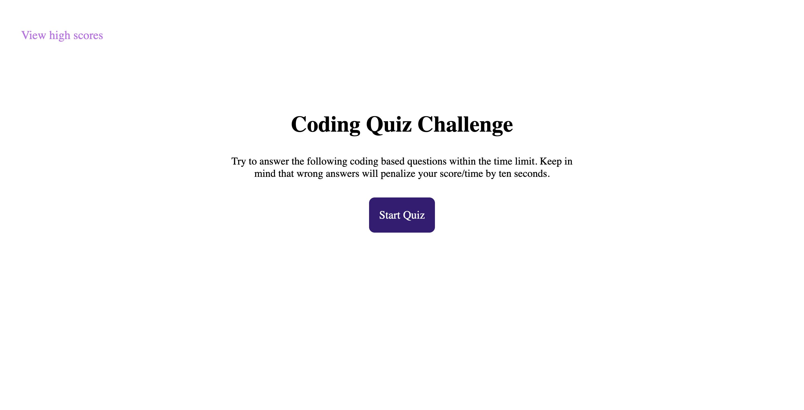

# javascript-quiz
In this javascript quiz you get 60 seconds to answer a series of questions on javacript. If you get the answer correctly you gain points and move on to the next question. Answer incorrectly and time and points will be deducted, and you will be asked to answer the question again. Once completed you can enter your name and save your score.

site link: https://emilypape.github.io/javascript-quiz/